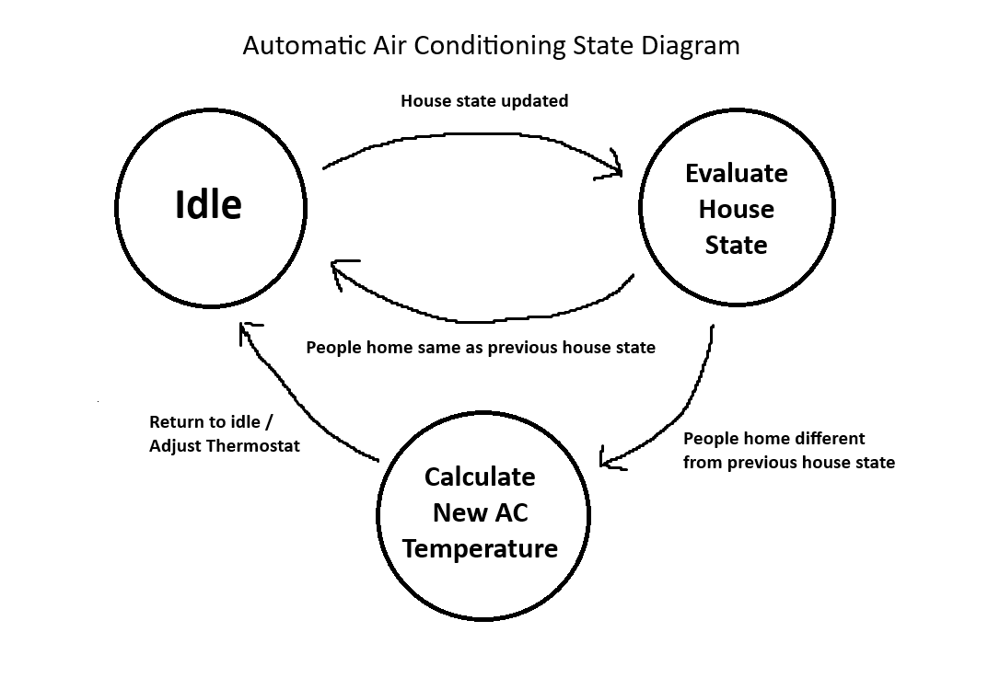
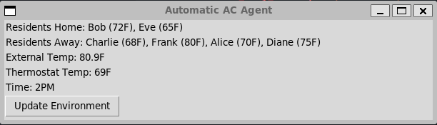

# cs3642-assignment-one
## Information
- Course: CS3642
- Student Name: Daniel Tebor
- Student ID: 000982064
- Assignment #: 1
- Due Date: 09/16
- Signature: Daniel Tebor

## Automatic Air Conditioning Agent
The goal for assignment one is to create a simple AI model. The model idea is to create an air conditioning agent. The agent will be given the desired temperatures of everyone living at a house. Every hour, the model will assess who is currently home and adjust the temperature to the average of the current people who are home.

## Agent Design & Implementation
### Design
The agent will be static, as in it is not constantly polling the house environment for changes. This is because this is not a real implementation of an automatic ac agent. The house environment is simulated, and the agent will be notified when the house state is updated. The following is a diagram of the agent design:<br><br>


### Implementation

This class represents the automatic air conditioning agent. The agent doesn't do anything until it is informed of a new environment state by calling the inform_new_environment_state method. The agent then modifies the environment by setting the thermostat temp
if the people currently in the house have changed.

```python
class ACAgent:
    def __init__(self, environment: HouseEnvironment):
        self._prev_environment_state = copy.deepcopy(environment)
        environment.thermostat_temp_fahrenheit = self._calculate_thermostat_temp(environment.residents_home)

    # Move agent out of the idle state and evaluate new environment state.
    def inform_new_environment_state(self, environment: HouseEnvironment):
        # Check if residents currently home have changed.
        # If someone has gone out or returned home, calculate new thermostat temp.
        if self._prev_environment_state.residents_home != environment.residents_home:
            # Check that someone is home.
            # If not, then set the thermostat temp to the eternal temp to save money.
            if len(environment.residents_home) != 0:
                environment.thermostat_temp_fahrenheit = self._calculate_thermostat_temp(environment.residents_home)
            else:
                environment.thermostat_temp_fahrenheit = environment.external_temp_fahrenheit

        # Update the previous environment state to the current environment state.
        self._prev_environment_state = copy.deepcopy(environment)

    # Calculates the new thermostat temp by averaging the preferred temps of all residents currently home.  
    def _calculate_thermostat_temp(self, residents_home: dict[str, float]) -> float:
        sum = 0
        for pref_temp in residents_home.values():
            sum += pref_temp
        return sum / len(residents_home)
```

## House Environment

This class represents the environment of the house. It is a very simple simulation that isn't meant to be realistic but rather to demonstrate the AC agent modifying its behavior based on an environment. The house environment keeps track of residents who are home and residents who are away. It also tracks the current setting of the thermostat.

```python
class HouseEnvironment:
    def __init__(self):
        self._residents_home = {}
        self._residents_away = {}
        self._external_temp_fahrenheit = 80.0
        self._thermostat_temp_fahrenheit = 80.0
        self._time = 1

    # Tell the environment to update itself. In the GUI, the user clicks a button to
    # progress the time by 1 hour, and this method is called when that happens.
    def update(self):
        self._time += 1
        # Randomly change the external temperature.
        self._external_temp_fahrenheit += random.uniform(-1, 1)

        moved_residents = {}

        for resident in list(self._residents_home):
            # Randomly decide if resident should leave or stay home. 
            # This is to simulate residents of the house going out for whatever reason.
            resident_should_leave = random.choice([True, False])
            if resident_should_leave:
                # Keep track of residents that gone out already.
                moved_residents[resident] = self._residents_home[resident]
                self._residents_away[resident] = self._residents_home[resident]
                del self._residents_home[resident]

        for resident in list(self._residents_away):
            # Randomly decide if resident should return home or stay away. 
            # This is to simulate residents of the house coming back from being out.
            resident_should_return = random.choice([True, False])
            # Check if the resident has gone out already.
            if resident_should_return and resident not in moved_residents:
                self._residents_home[resident] = self._residents_away[resident]
                del self._residents_away[resident]

    def add_resident(self, name: str, pref_temp_fahrenheit: float):
        self._residents_home[name] = pref_temp_fahrenheit

    @property
    def residents_home(self) -> dict[str, float]:
        return copy.deepcopy(self._residents_home)
    
    @property
    def residents_away(self) -> dict[str, float]:
        return copy.deepcopy(self._residents_away)
    
    @property
    def external_temp_fahrenheit(self) -> float:
        return self._external_temp_fahrenheit

    @property
    def thermostat_temp_fahrenheit(self) -> float:
        return self._thermostat_temp_fahrenheit
    
    @thermostat_temp_fahrenheit.setter
    def thermostat_temp_fahrenheit(self, thermostat_temp_fahrenheit: float):
        self._thermostat_temp_fahrenheit = thermostat_temp_fahrenheit

    @property
    def time(self) -> int:
        return self._time
```

## Visualization
To visualize a house environment, a simple gui shows the current residents who are home/away. It also shows the current time and the current thermostat temp. The user can click a button to progress the time by 1 hour. When the time is progressed, the house environment will update itself by randomly deciding if a resident should leave or return home. The AC agent will be notified of the new environment state and will adjust the thermostat temp if necessary.

```python
# Initialize new house environment and AC agent.
house_environment = HouseEnvironment()
house_environment.add_resident('Alice', 70)
house_environment.add_resident('Bob', 72)
house_environment.add_resident('Charlie', 68)
house_environment.add_resident('Diane', 75)
house_environment.add_resident('Eve', 65)
house_environment.add_resident('Frank', 80)

ac_agent = ACAgent(house_environment)

# Create GUI.
root = tk.Tk()

def dict_to_str(dict: dict[str, float]):
    return ', '.join(f'{k} ({v}F)' for k, v in dict.items())

residents_home_str = tk.StringVar(value=f'Residents Home: {dict_to_str(house_environment.residents_home)}')
residents_away_str = tk.StringVar(value=f'Residents Away: {dict_to_str(house_environment.residents_away)}')
external_temp_str = tk.StringVar(value='External Temp: ' + str(format(house_environment.external_temp_fahrenheit, '.1f')) + 'F')
thermostat_temp_str = tk.StringVar(value=f'Thermostat Temp: {int(house_environment.thermostat_temp_fahrenheit + 0.5)}F')
time_str = tk.StringVar(value=f'Time: {house_environment.time}PM')

def update_environment():
    house_environment.update()
    ac_agent.inform_new_environment_state(house_environment)

    # Update GUI vars.
    residents_home_str.set(f'Residents Home: {dict_to_str(house_environment.residents_home)}')
    residents_away_str.set(f'Residents Away: {dict_to_str(house_environment.residents_away)}')
    external_temp_str.set('External Temp: ' + str(format(house_environment.external_temp_fahrenheit, '.1f')) + 'F')
    # Round thermostat temp to nearest integer since thermostat temperature setting is an integer on most models.
    thermostat_temp_str.set(f'Thermostat Temp: {int(house_environment.thermostat_temp_fahrenheit + 0.5)}F')
    time_str.set(f'Time: {house_environment.time}PM')

    # Exit once time reaches 12AM.
    if house_environment.time == 12:
        root.destroy()

residents_home_label = tk.Label(root, textvariable=residents_home_str)
residents_away_label = tk.Label(root, textvariable=residents_away_str)
external_temp_label = tk.Label(root, textvariable=external_temp_str)
thermostat_temp_label = tk.Label(root, textvariable=thermostat_temp_str)
time_label = tk.Label(root, textvariable=time_str)

update_environment_button = tk.Button(root, text='Update Environment', command=update_environment)

residents_home_label.pack(anchor='w')
residents_away_label.pack(anchor='w')
external_temp_label.pack(anchor='w')
thermostat_temp_label.pack(anchor='w')
time_label.pack(anchor='w')
update_environment_button.pack(anchor='w')

# Formatting
root.title('Automatic AC Agent')
root.geometry('600x140')
root.resizable(False, False)

# Start GUI.
root.mainloop()
```
The following is an example of the gui running. It displays the people currently home, the people currently out, the external temperature, the thermostat temperature, and the current time. Additionally, the prefered temperature of each resident is shown next to their name.<br></br>


## Tasks Agent Solves
Setting a thermostat temperature is typically simple when there is one person, but when there are multiple people in a space it can be difficult to find a temperature that everyone is comfortable with. The automatic AC agent solves this problem by setting the thermostat temperature to the average of the preferred temperatures of the people currently in the space. This way, everyone is comfortable with the temperature as is reasonably possible. Additionally, the agent saves money by setting the thermostat temperature to the external temperature when no one is home, which is convenient since it easy to forget to turn off the AC when leaving the house.

### Limitations
Some users may prefer money saving and would prefer the ac to be either too hot or too cold for peoples preferences (depending on the external temperature) in order to save on the electricity bill. This agent does not allow for this behavior. Additionally, the ac agent does not take into account the time of day. For example, it may be more comfortable to have the ac set to a lower temperature at night than during the day.

## Video Presentation
